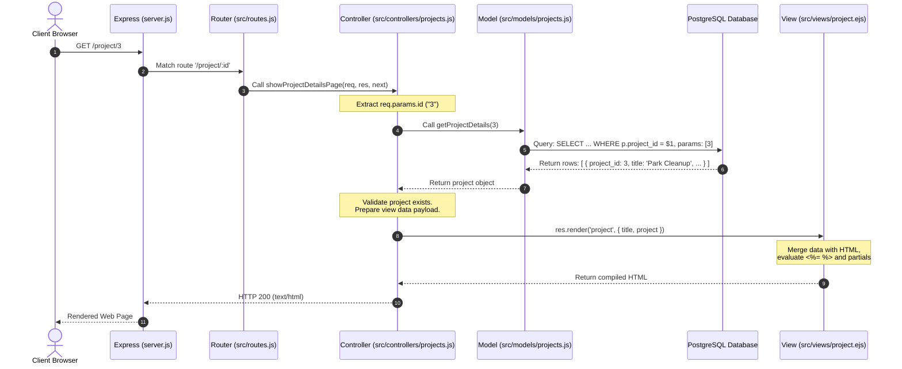

# Complete MVC Architecture Blueprint & Technical Guide

> **Project:** CSE 340 Backend Development II  
> **Workspace:** [`/home/Ilegubo/Documents/CSE340-BYU-Backend-Dev-II`](file:///home/Ilegubo/Documents/CSE340-BYU-Backend-Dev-II)  
> **Previous Session References:** [Session 6a07c90a](conversation://6a07c90a-0f67-4a90-891e-a19db2a7a054) & [Session 111cfa3c](conversation://111cfa3c-ec60-450c-8a4b-4285815adc4a) (Foundation: [Commit 07c8676](file:///home/Ilegubo/Documents/CSE340-BYU-Backend-Dev-II), Completion: [Commit 6fa50ba](file:///home/Ilegubo/Documents/CSE340-BYU-Backend-Dev-II))

---

## Table of Contents
1. [Executive Summary of Changes in the Immediate Past Session](#1-executive-summary-of-changes-in-the-immediate-past-session)
2. [Detailed File-by-File Breakdown of Past Session Modifications](#2-detailed-file-by-file-breakdown-of-past-session-modifications)
3. [The Universal Reusable MVC Blueprint (Step-by-Step Recipe)](#3-the-universal-reusable-mvc-blueprint-step-by-step-recipe)
4. [Visual Architecture & Request-Response Data Flow](#4-visual-architecture--request-response-data-flow)
5. [Core Fundamentals & Deep Technical Knowledge Required](#5-core-fundamentals--deep-technical-knowledge-required)
   - [5.1 JavaScript & Node.js Fundamentals](#51-javascript--nodejs-fundamentals)
   - [5.2 Express Framework Mechanics](#52-express-framework-mechanics)
   - [5.3 PostgreSQL & Database Architecture](#53-postgresql--database-architecture)
   - [5.4 EJS Templating & Dynamic HTML Rendering](#54-ejs-templating--dynamic-html-rendering)
   - [5.5 Security & Robust Error Handling](#55-security--robust-error-handling)
6. [Quick Verification & Debugging Checklist](#6-quick-verification--debugging-checklist)

---

## 1. Executive Summary of Changes in the Immediate Past Session

In the immediate past session ([Session 6a07c90a](conversation://6a07c90a-0f67-4a90-891e-a19db2a7a054), confirmed in [Session 111cfa3c](conversation://111cfa3c-ec60-450c-8a4b-4285815adc4a) and committed in [Commit 6fa50ba](file:///home/Ilegubo/Documents/CSE340-BYU-Backend-Dev-II)), the application was evolved from a basic static route listing into a **fully dynamic, relational Model-View-Controller (MVC) system with parameterized routes and detail views**.

### What Problems Were Solved?
1. **Unbounded Data Retrieval**: Previously, `/projects` fetched all records indiscriminately with `getAllProjects()`. This was replaced by `getUpcomingProjects(5)`, which filters for upcoming dates (`p.date >= CURRENT_DATE`), sorts chronologically (`ORDER BY p.date ASC`), limits output (`LIMIT $1`), and enriches each project with its parent organization name via an SQL `JOIN`.
2. **Missing Dynamic Detail Pages**: Users could not view details of an individual project or an individual organization. We introduced dynamic path parameters (`/project/:id` and `/organization/:id`) to route to dedicated detail controllers and views.
3. **Decoupled Relational Navigation**: The application now features bidirectional hyperlinking:
   - Project cards link to their individual detail page (`/project/:id`) and to their parent organization (`/organization/:id`).
   - Organization pages list all active service projects belonging specifically to that organization.
4. **Defensive Error Handling**: Controllers were refactored with `try/catch` blocks and 404 validation (`if (!item) { const err = new Error(...); err.status = 404; return next(err); }`), ensuring missing IDs do not crash Node or hang the HTTP request.

---

## 2. Detailed File-by-File Breakdown of Past Session Modifications

### A. Model Layer (`src/models/`)
The model is strictly responsible for database queries, parameterization, and returning raw JavaScript objects or arrays.

* **[`src/models/projects.js`](file:///home/Ilegubo/Documents/CSE340-BYU-Backend-Dev-II/src/models/projects.js)**:
  * **Added `getUpcomingProjects(number_of_projects = 5)`**:
    * Executes an `INNER JOIN` between `projects p` and `organization o` on `p.organization_id = o.organization_id`.
    * Filters with `WHERE p.date >= CURRENT_DATE`.
    * Orders with `ORDER BY p.date ASC`.
    * Limits output via parameterized placeholder `LIMIT $1` with `queryParams = [number_of_projects]`.
  * **Added `getProjectDetails(id)`**:
    * Queries a single project by `p.project_id = $1` joining `organization` to get `o.name AS organization_name`.
    * Returns the single object `result.rows[0]` or `null` if empty.
  * **Added `getProjectsByOrganizationId(organizationId)`**:
    * Queries all projects belonging to a specific organization `WHERE organization_id = $1 ORDER BY date`.
* **[`src/models/organizations.js`](file:///home/Ilegubo/Documents/CSE340-BYU-Backend-Dev-II/src/models/organizations.js)**:
  * **Added `getOrganizationDetails(organizationId)`**:
    * Parameterized query selecting `organization_id`, `name`, `description`, `contact_email`, `logo_filename` `WHERE organization_id = $1`.
    * Returns `result.rows[0] || null`.

### B. Controller Layer (`src/controllers/`)
The controller accepts HTTP requests, extracts parameters, coordinates models, handles business logic, and renders views.

* **[`src/controllers/projects.js`](file:///home/Ilegubo/Documents/CSE340-BYU-Backend-Dev-II/src/controllers/projects.js)**:
  * Replaced `projectsPage` with `showProjectsPage`: Calls `getUpcomingProjects(5)`, sets page title to `'Upcoming Service Projects'`, and passes `{ title, projects }` to `projects.ejs`.
  * Added `showProjectDetailsPage`:
    * Extracts `const id = req.params.id`.
    * Awaits `getProjectDetails(id)`.
    * Validates existence: if null, creates `err.status = 404` and forwards to `next(err)`.
    * Renders `project.ejs` passing `{ title: project.title, project }`.
* **[`src/controllers/organizations.js`](file:///home/Ilegubo/Documents/CSE340-BYU-Backend-Dev-II/src/controllers/organizations.js)**:
  * Replaced `organizationsPage` with `showOrganizationsPage`: Fetches all organizations and renders `organizations.ejs`.
  * Added `showOrganizationDetailsPage`:
    * Extracts `organizationId = req.params.id`.
    * Queries `getOrganizationDetails(organizationId)`. If not found, throws 404.
    * Queries `getProjectsByOrganizationId(organizationId)`.
    * Renders `organization.ejs` passing `{ title: organizationDetails.name, organizationDetails, projects }`.

### C. Router Layer (`src/routes.js`)
The router maps HTTP verbs and URL paths to controller handler functions.

* **[`src/routes.js`](file:///home/Ilegubo/Documents/CSE340-BYU-Backend-Dev-II/src/routes.js)**:
  * Added route aliases for singular and plural detail paths:
    ```javascript
    router.get(['/organization/:id', '/organizations/:id'], showOrganizationDetailsPage);
    router.get(['/project/:id', '/projects/:id'], showProjectDetailsPage);
    ```
  * Preserved top-level routes for collections:
    ```javascript
    router.get('/organizations', showOrganizationsPage);
    router.get('/projects', showProjectsPage);
    router.get('/categories', categoriesPage);
    ```

### D. View Layer (`src/views/`)
Views present data using EJS templating and partials.

* **[`src/views/project.ejs`](file:///home/Ilegubo/Documents/CSE340-BYU-Backend-Dev-II/src/views/project.ejs)** *(New File)*:
  * Single project detail template displaying title, formatted date (`new Date(project.date).toLocaleDateString(...)`), location, description, and link back to parent organization `/organization/<%= project.organization_id %>`.
* **[`src/views/organization.ejs`](file:///home/Ilegubo/Documents/CSE340-BYU-Backend-Dev-II/src/views/organization.ejs)** *(New File)*:
  * Organization detail template displaying logo, description, mailto link, and a list of related service projects linking to `/project/<%= project.project_id %>`.
* **[`src/views/projects.ejs`](file:///home/Ilegubo/Documents/CSE340-BYU-Backend-Dev-II/src/views/projects.ejs)** *(Updated)*:
  * Updated title and cards to render hyperlinks on project titles (`/project/<%= project.project_id %>`) and organization names (`/organization/<%= project.organization_id %>`).
* **[`src/views/organizations.ejs`](file:///home/Ilegubo/Documents/CSE340-BYU-Backend-Dev-II/src/views/organizations.ejs)** *(Updated)*:
  * Updated organization names to link directly to `/organization/<%= organization.organization_id %>`.

### E. Static Assets (`public/css/main.css`)
* Added CSS classes for `.projects-list`, `.project-card`, `.project-details`, improving responsive layout, card borders, margins, and typography.

---

## 3. The Universal Reusable MVC Blueprint (Step-by-Step Recipe)

Follow this 7-step blueprint anytime you need to build or recreate an Express + PostgreSQL MVC application from scratch.

```
project-root/
├── public/
│   ├── css/
│   │   └── main.css
│   └── images/
├── src/
│   ├── controllers/
│   │   ├── [resource].js          <-- Business logic, parameter extraction, renders views
│   │   ├── errors.js              <-- Error simulation & handlers
│   │   └── index.js               <-- Home page controller
│   ├── models/
│   │   ├── db.js                  <-- PostgreSQL connection pool & query logger
│   │   └── [resource].js          <-- SQL queries, JOINs, parameterized inputs
│   ├── views/
│   │   ├── partials/
│   │   │   ├── header.ejs         <-- Reusable HTML head & navigation
│   │   │   └── footer.ejs         <-- Reusable footer & closing tags
│   │   ├── [resource].ejs         <-- Single item detail view
│   │   └── [resources].ejs        <-- Collection list view
│   └── routes.js                  <-- Express router URL mapping
├── .env                           <-- Environment variables (PORT, DB_URL, NODE_ENV)
├── package.json                   <-- Dependencies ("type": "module")
└── server.js                      <-- Application entry point & middleware pipeline
```

### Step 1: Package Configuration (`package.json`)
Ensure ES Modules are enabled so you can use modern `import` / `export` syntax.

```json
{
  "name": "my-mvc-app",
  "version": "1.0.0",
  "type": "module",
  "main": "server.js",
  "scripts": {
    "dev": "nodemon server.js",
    "start": "node server.js"
  },
  "dependencies": {
    "ejs": "^6.0.1",
    "express": "^5.2.1",
    "pg": "^8.23.0"
  },
  "devDependencies": {
    "nodemon": "^3.1.14"
  }
}
```

---

### Step 2: Database Connection Pool (`src/models/db.js`)
Create a singleton connection pool using `pg.Pool`. Configure SSL for hosted cloud databases (Supabase, Neon, AWS RDS, Render) and add an optional query logger for development.

```javascript
import { Pool } from 'pg';

const pool = new Pool({
    connectionString: process.env.DB_URL,
    ssl: { rejectUnauthorized: false } // Required for self-signed cloud DB certificates
});

let db = pool;

// Optional: Development query timing & logging
if (process.env.NODE_ENV === 'development' && process.env.ENABLE_SQL_LOGGING === 'true') {
    db = {
        async query(text, params) {
            const start = Date.now();
            const res = await pool.query(text, params);
            const duration = Date.now() - start;
            console.log('Executed query:', {
                text: text.replace(/\s+/g, ' ').trim(),
                duration: `${duration}ms`,
                rows: res.rowCount
            });
            return res;
        },
        async close() {
            await pool.end();
        }
    };
}

export const testConnection = async () => {
    try {
        const result = await db.query('SELECT NOW() as current_time');
        console.log('Database connected successfully:', result.rows[0].current_time);
        return true;
    } catch (error) {
        console.error('Database connection failed:', error.message);
        throw error;
    }
};

export default db;
```

---

### Step 3: Model Creation (`src/models/[resource].js`)
The model **only** communicates with PostgreSQL. It contains zero HTTP knowledge (`req` and `res` never belong here).

```javascript
import db from './db.js';

// 1. Get collection (with optional filtering / pagination)
export const getUpcomingItems = async (limit = 5) => {
    const query = `
        SELECT 
            i.item_id,
            i.title,
            i.date,
            i.category_id,
            c.name AS category_name
        FROM items i
        JOIN categories c ON i.category_id = c.category_id
        WHERE i.date >= CURRENT_DATE
        ORDER BY i.date ASC
        LIMIT $1;
    `;
    const result = await db.query(query, [limit]);
    return result.rows;
};

// 2. Get single record by ID
export const getItemById = async (id) => {
    const query = `
        SELECT 
            i.item_id,
            i.title,
            i.description,
            i.date,
            c.name AS category_name
        FROM items i
        JOIN categories c ON i.category_id = c.category_id
        WHERE i.item_id = $1;
    `;
    const result = await db.query(query, [id]);
    return result.rows.length > 0 ? result.rows[0] : null;
};
```

---

### Step 4: Controller Creation (`src/controllers/[resource].js`)
The controller coordinates models, processes inputs, manages errors, and invokes `res.render()`.

```javascript
import { getUpcomingItems, getItemById } from '../models/[resource].js';

// List view controller
export const showItemsPage = async (req, res, next) => {
    try {
        const items = await getUpcomingItems(5);
        res.render('items', {
            title: 'Upcoming Items',
            items
        });
    } catch (error) {
        next(error); // Forward database or runtime errors to Express error handler
    }
};

// Detail view controller
export const showItemDetailPage = async (req, res, next) => {
    try {
        const { id } = req.params; // Extract route parameter
        const item = await getItemById(id);

        if (!item) {
            const err = new Error(`Item with ID ${id} not found`);
            err.status = 404;
            return next(err); // Triggers 404 handler
        }

        res.render('item', {
            title: item.title,
            item
        });
    } catch (error) {
        next(error);
    }
};
```

---

### Step 5: Router Mapping (`src/routes.js`)
Use `express.Router()` to define clean endpoints. Keep routes readable by delegating all execution to controllers.

```javascript
import express from 'express';
import { homePage } from './controllers/index.js';
import { showItemsPage, showItemDetailPage } from './controllers/[resource].js';

const router = express.Router();

router.get('/', homePage);
router.get('/items', showItemsPage);
router.get('/item/:id', showItemDetailPage);

export default router;
```

---

### Step 6: View Templates (`src/views/`)
Use EJS partials for global layouts and inject dynamic data safely.

**Header Partial (`src/views/partials/header.ejs`)**:
```html
<!DOCTYPE html>
<html lang="en">
<head>
    <meta charset="UTF-8">
    <meta name="viewport" content="width=device-width, initial-scale=1.0">
    <title><%= title %></title>
    <link rel="stylesheet" href="/css/main.css">
</head>
<body>
    <nav>
        <ul>
            <li><a href="/">Home</a></li>
            <li><a href="/items">Items</a></li>
        </ul>
    </nav>
```

**Collection View (`src/views/items.ejs`)**:
```html
<%- include('partials/header') %>
<main>
    <h1><%= title %></h1>
    <% if (items && items.length > 0) { %>
        <ul class="items-list">
            <% items.forEach(item => { %>
                <li>
                    <h2><a href="/item/<%= item.item_id %>"><%= item.title %></a></h2>
                    <p>Category: <%= item.category_name %></p>
                    <p>Date: <%= new Date(item.date).toLocaleDateString() %></p>
                </li>
            <% }) %>
        </ul>
    <% } else { %>
        <p>No items found.</p>
    <% } %>
</main>
<%- include('partials/footer') %>
```

**Detail View (`src/views/item.ejs`)**:
```html
<%- include('partials/header') %>
<main>
    <h1><%= item.title %></h1>
    <p><strong>Category:</strong> <%= item.category_name %></p>
    <p><strong>Date:</strong> <%= new Date(item.date).toLocaleDateString() %></p>
    <p><strong>Description:</strong> <%= item.description %></p>
    <p><a href="/items">&larr; Back to all items</a></p>
</main>
<%- include('partials/footer') %>
```

---

### Step 7: Express Server Orchestration (`server.js`)
Assemble middleware, configure view engine, serve static assets, mount routes, and start the listener after testing database connectivity.

```javascript
import express from 'express';
import path from 'path';
import { fileURLToPath } from 'url';
import router from './src/routes.js';
import { testConnection } from './src/models/db.js';

const __filename = fileURLToPath(import.meta.url);
const __dirname = path.dirname(__filename);

const app = express();
const PORT = process.env.PORT || 3000;
const NODE_ENV = process.env.NODE_ENV?.toLowerCase() || 'production';

// View Engine
app.set('view engine', 'ejs');
app.set('views', path.join(__dirname, 'src/views'));

// Middleware
app.use(express.static(path.join(__dirname, 'public')));
app.use((req, res, next) => {
    res.locals.NODE_ENV = NODE_ENV;
    next();
});

// Mount Routes
app.use(router);

// Centralized Error Handling Middleware
app.use((err, req, res, next) => {
    console.error(err.stack);
    const status = err.status || 500;
    res.status(status).render('errors', {
        title: `Error ${status}`,
        message: err.message,
        status
    });
});

// Bootstrapping
app.listen(PORT, async () => {
    try {
        await testConnection();
        console.log(`Server running at http://localhost:${PORT} in ${NODE_ENV} mode`);
    } catch (error) {
        console.error('Failed to connect to database on startup:', error);
    }
});
```

---

## 4. Visual Architecture & Request-Response Data Flow

### MVC Sequence Diagram



### Component Responsibility Matrix

| Layer | Primary Role | Allowed Dependencies | Never Allowed To Do |
| :--- | :--- | :--- | :--- |
| **Model** (`src/models/`) | Data persistence, SQL querying, mapping tables | `src/models/db.js` | Direct HTTP interactions, accessing `req` or `res`, HTML generation |
| **View** (`src/views/`) | Presentation layout, HTML markup, user interface | Partial templates, CSS, JS assets | Executing SQL queries, business logic mutations |
| **Controller** (`src/controllers/`) | Orchestration, validation, request decoding | Models, views, helpers | Writing raw SQL queries, generating raw HTML |
| **Router** (`src/routes.js`) | URL pattern matching, HTTP verb binding | Controllers | Querying DB, rendering HTML directly |

---

## 5. Core Fundamentals & Deep Technical Knowledge Required

To confidently recreate and troubleshoot this architecture, you must master the following fundamentals across JavaScript, Express, PostgreSQL, and EJS.

### 5.1 JavaScript & Node.js Fundamentals

#### A. ES Modules vs CommonJS
Modern Node.js applications use ES Modules (`import`/`export`).
- In `package.json`, set `"type": "module"`.
- When importing local files, you **must explicitly specify the file extension**:
  ```javascript
  import router from './src/routes.js'; // Correct
  import router from './src/routes';    // SyntaxError in ES Modules
  ```
- Because ES Modules do not provide `__dirname` and `__filename` globals by default, reconstruct them using Node's `url` and `path` modules:
  ```javascript
  import { fileURLToPath } from 'url';
  import path from 'path';

  const __filename = fileURLToPath(import.meta.url);
  const __dirname = path.dirname(__filename);
  ```

#### B. Asynchronous Programming (`async` / `await` and Promises)
All database interactions in Node are asynchronous and return Promises.
- Functions interacting with `db.query()` must be marked `async`.
- Always `await` promises to pause execution until the query resolves:
  ```javascript
  const result = await db.query(query, params);
  ```
- Any controller calling an `async` model function must itself be `async`.
- Wrap asynchronous logic in `try / catch` blocks to catch promise rejections and prevent unhandled promise termination:
  ```javascript
  try {
      const data = await getModelData();
  } catch (err) {
      next(err); // Forwards error down the middleware pipeline
  }
  ```

#### C. Destructuring & Array Methods
- **Object Destructuring**: Extracts properties cleanly:
  ```javascript
  const { id } = req.params;
  const { title, projects } = data;
  ```
- **Array Iteration (`forEach`)**: Used in EJS templates to loop through query rows:
  ```html
  <% projects.forEach(project => { %>
      <li><%= project.title %></li>
  <% }) %>
  ```

---

### 5.2 Express Framework Mechanics

#### A. The Middleware Pipeline (`req, res, next`)
Express processes requests sequentially through a pipeline of middleware functions.
- A middleware function takes `(req, res, next)`:
  - `req`: Incoming HTTP request object (headers, URL, params, body).
  - `res`: Outgoing HTTP response object (`res.render()`, `res.status()`, `res.redirect()`).
  - `next()`: Callback function that passes control to the next handler in the chain.
- If a middleware does not send a response (`res.send`, `res.render`) and does not call `next()`, **the client's browser will hang indefinitely**.

#### B. `res.locals` (Application-Wide Template Variables)
Data placed on `res.locals` is accessible to every EJS template rendered during that request lifecycle without having to manually pass it in every `res.render()` call:
```javascript
app.use((req, res, next) => {
    res.locals.NODE_ENV = NODE_ENV;
    res.locals.currentYear = new Date().getFullYear();
    next();
});
```

#### C. Route Parameters (`req.params`) vs Query Parameters (`req.query`)
| Parameter Type | URL Pattern | How to Access | Architectural Purpose |
| :--- | :--- | :--- | :--- |
| **Route Parameter** | `/project/:id` &rarr; `/project/4` | `req.params.id` | **Resource Identity**: Identifies a specific entity in the system. |
| **Query Parameter** | `/projects?limit=5&sort=asc` | `req.query.limit` | **Filtering / Modifiers**: Used for sorting, pagination, search queries. |

---

### 5.3 PostgreSQL & Database Architecture

#### A. Relational Design & Foreign Keys
In normalized relational databases, data is split into specialized tables to prevent duplication (anomaly prevention):
- `projects` table: Contains `project_id`, `title`, `description`, `date`, `location`, `organization_id`.
- `organization` table: Contains `organization_id`, `name`, `contact_email`, `logo_filename`.
- `organization_id` in `projects` is a **Foreign Key** pointing to `organization_id` (Primary Key) in `organization`.

#### B. Relational Queries with `JOIN`
When a view requires information from both tables (e.g. project details + the organization's human-readable name), an SQL `JOIN` bridges them:
```sql
SELECT
    p.project_id,
    p.title,
    p.date,
    p.organization_id,
    o.name AS organization_name
FROM projects p
JOIN organization o ON p.organization_id = o.organization_id
WHERE p.date >= CURRENT_DATE
ORDER BY p.date ASC
LIMIT $1;
```
> [!IMPORTANT]
> Always alias columns when table names clash or when a clearer name is needed in JavaScript (e.g., `o.name AS organization_name`).

#### C. SQL Injection Prevention via Parameterized Queries
> [!CAUTION]
> **Never** concatenate or interpolate user input directly into SQL strings.

❌ **Dangerous (Vulnerable to SQL Injection)**:
```javascript
// A malicious user could pass id = "1; DROP TABLE projects;--"
const query = `SELECT * FROM projects WHERE project_id = ${req.params.id}`;
const result = await db.query(query);
```

✅ **Secure (Parameterized Query with Placeholders)**:
```javascript
// Parameterized query: $1 is passed out-of-band to PostgreSQL
const query = `SELECT * FROM projects WHERE project_id = $1`;
const queryParams = [req.params.id];
const result = await db.query(query, queryParams);
```
- **Why this works**: PostgreSQL compiles the query plan *before* inserting the parameters. Input is treated strictly as literal data, never as executable SQL code.
- In PostgreSQL, parameters are 1-indexed placeholders: `$1`, `$2`, `$3`, etc.

#### D. Connection Pooling (`pg.Pool`)
Creating a TCP connection to PostgreSQL takes 20–100ms. A `Pool` maintains a cache of active connections ready for reuse:
- Avoid calling `pool.connect()` and `client.release()` manually for simple queries; `pool.query(sql, params)` automatically acquires a client from the pool, runs the query, and releases it back to the pool.
- When hosting PostgreSQL on cloud providers (like Neon, Supabase, or AWS RDS), certificates are often self-signed. Set `ssl: { rejectUnauthorized: false }` to avoid `UNABLE_TO_VERIFY_LEAF_SIGNATURE` connection errors.

---

### 5.4 EJS Templating & Dynamic HTML Rendering

EJS (Embedded JavaScript) compiles templates into HTML on the server before transmitting them to the client.

#### The Three Core EJS Tags:
1. `<%= value %>` **(Escaped Output)**: Evaluates JavaScript and escapes HTML special characters (`<`, `>`, `&`, `"`). Use this for all user-generated and database text to prevent Cross-Site Scripting (XSS).
   ```html
   <h1><%= project.title %></h1>
   ```
2. `<%- value %>` **(Unescaped / Raw Output)**: Outputs the raw string without escaping. Used for including partial templates:
   ```html
   <%- include('partials/header') %>
   ```
3. `<% code %>` **(Scriptlet / Control Flow)**: Executes JavaScript statements (conditionals, loops) without printing output to the page:
   ```html
   <% if (projects && projects.length > 0) { %>
       <% projects.forEach(project => { %>
           <li><%= project.title %></li>
       <% }) %>
   <% } else { %>
       <p>No projects available.</p>
   <% } %>
   ```

#### Safe Date Formatting in EJS:
PostgreSQL `date` or `timestamp` columns are converted by `node-pg` into JavaScript `Date` objects. Format them cleanly in EJS:
```html
<%= new Date(project.date).toLocaleDateString('en-US', { weekday: 'long', year: 'numeric', month: 'long', day: 'numeric' }) %>
```

---

### 5.5 Security & Robust Error Handling

#### A. 404 Not Found Handling
When a user requests a resource ID that does not exist in the database (e.g. `/project/9999`), the model returns `null` or an empty array. The controller must explicitly check for this and emit an HTTP 404:
```javascript
const project = await getProjectDetails(id);

if (!project) {
    const err = new Error(`Service project #${id} was not found.`);
    err.status = 404;
    return next(err); // Hands off to central error middleware
}
```

#### B. Centralized Error Middleware
Define an error middleware with 4 arguments `(err, req, res, next)` at the bottom of `server.js` (after all routes):
```javascript
app.use((err, req, res, next) => {
    console.error('Unhandled Application Error:', err);
    const status = err.status || 500;
    res.status(status).render('error', {
        title: `Error ${status}`,
        message: NODE_ENV === 'production' && status === 500 
            ? 'An internal server error occurred.' 
            : err.message
    });
});
```

---

## 6. Quick Verification & Debugging Checklist

Before committing code or deploying your MVC application, run through this checklist:

1. **Syntax Verification**:
   ```bash
   node -c server.js
   node -c src/routes.js
   node -c src/controllers/*.js
   node -c src/models/*.js
   ```
2. **Database Verification**:
   - Ensure the database test connection executes and logs a timestamp on server startup.
   - Verify that column names in SQL match the table schema (`organization_id`, `project_id`, etc.).
3. **Route & Parameter Verification**:
   - Test collection route: `curl http://localhost:3000/projects` (should return HTTP 200 with 5 upcoming projects).
   - Test valid detail route: `curl http://localhost:3000/project/1` (should return HTTP 200 with details).
   - Test invalid detail route: `curl -I http://localhost:3000/project/99999` (should return HTTP 404).
4. **Link Integrity**:
   - Click from `/projects` into an individual `/project/:id`.
   - Click the organization link inside the project page to navigate to `/organization/:id`.
   - Verify the organization page lists its associated projects and links back to each project details page.
